<div align="center">

<h1>🛠️ RADKit NetOps Agent</h1>

<p>
  A multi-tool network housekeeping AI agent use case for your
  <a href="https://radkit.cisco.com/">Cisco RADKit</a> service.
</p>

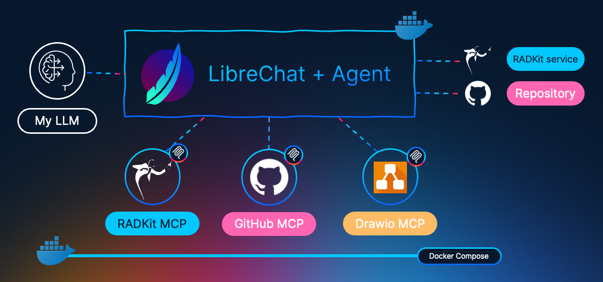

<br />


</div>

---

## 📘 About

This repository provides a reference implementation for running MCP servers and using them as tools for an AI agent specialized in network operations.

Included components:

| Component | Purpose |
|---|---|
| 🌐 **RADKit** MCP server | Inventory access and network operations |
| 🧩 **GitHub** MCP server | Repository and issue management workflows |
| 🗺️ **DrawIO** MCP server | Diagram authoring workflows |

These three MCP servers are implemented as services in Docker Compose.

This project includes instructions on how to set up the environment, run containers that serve these MCP servers, and onboard them into the open-source [LibreChat](https://www.librechat.ai/) platform to create an AI agent with a specific persona.

## ⚙️ The official RADKit MCP server

RADKit includes an MCP server that can connect to your RADKit service and use the [Client API](https://radkit.cisco.com/docs/client_api/index.html) to enable AI-driven operations across your device inventory.

This MCP server exposes a single tool: __radkit_eval__. Its purpose is to generate and execute Python code based on the Client API, which optimizes how your agent interacts with your RADKit service. Instead of exposing one tool per activity (retrieve inventory, execute commands, and so on), the MCP server can generate a Python snippet that dynamically uses Client API features such as filters and many-to-many command execution across devices.

### Testing your RADKit MCP server

> If you want to deploy the AI Agent right away, skip to the [Running the AI Agent](#running-the-ai-agent) section.

To deploy and test your RADKit MCP server stand-alone (no Docker), follow these steps:

Ensure the following are installed on your host system:

- Python 3.12+
- uv

From repository root:

```bash
cd radkit-mcp
```

Create and activate a virtual environment:

```bash
uv venv -p 3.13
source .venv/bin/activate
```

Install the dependencies:

```bash
uv sync
```

Create your local service config from the example:

```bash
cp service.config.direct.example service.config.direct
```

Then edit your `service.config.direct` file with your RADKit connection values:

```json
{
  "type": "direct",
  "username": "your_user@your_domain.com",
  "password_base64": "your_E2EE_password_from_the_webui_in_base64",
  "host": "your_radkit_host",
  "rpc_port": your_radkit_rpc_port
}
```

The parameter `type` supports four connection types:

| `type` | `method` | Auth mechanism | Notes |
|---|---|---|---|
| `direct` | — | username + password (base64) | Connects directly to a local RADKit service (`host`:`rpc_port`) |
| `cloud` | `api_key` | Encrypted access token file | Token stored in `access_token_path`; passphrase via `prompt` or keyring |
| `cloud` | `certificate` | Client certificate | Certificate must already be provisioned |
| `cloud` | `sso` | Single Sign-On (browser) | Browser-based SSO flow |

For this demo, we use `direct`.

> ⚠️ When choosing `direct`, your RADKit service needs to be enabled with RPC and have a RPC port assigned. This can be checked by navigating in your service's Web UI to `Settings > service.connectivity.port_direct_rpc`. Default is **8181**

> ⚠️ The **E2EE password** for your remote user can be found in the user details in the Web UI: `Remote Users > <your user> > E2EE validation token`. **It is NOT encoded in base64** by default. Encode it before adding it to the file.

Once the file details are populated, start the RADKit MCP server with the following command:

```bash
uv run --no-sync radkit-llm mcp-server \
  --port 8082 \
  --sandbox subprocess \
  --service-config service.config.direct \
  --profile radkit-mcp-profile.py \
  --prompt radkit-mcp-prompt.txt \
  --auto-approve \
  --mcp-log-dir logs/
```

The following are the available options and parameters for this command:

| Parameter | Type | Required | Options / Default | Description |
|---|---|---|---|---|
| `--port` | integer | No | any port (e.g. `8082`) | TCP port the MCP server listens on |
| `--sandbox` | choice | **Yes** | `subprocess` \| `bubblewrap` | `subprocess`: simple, cross-platform, no isolation. `bubblewrap`: Linux-only, network- and filesystem-isolated sandbox. |
| `--service-config` | path | No | — | Path to a JSON service connection config. Omit to allow the MCP client to connect to any service interactively (elicitation flow). |
| `--auto-approve` | flag | No | off by default | Automatically approve every RADKit interaction. **Required for LibreChat**: its MCP client cannot complete the elicitation flow. |
| `--profile` | file | No | — | Python script to expand how it processes the data before it interacts with the target RADKit service. |
| `--prompt` | file | No | — | Text/Markdown file whose content is **appended** to the built-in LLM system prompt. |
| `--override-prompt` | file | No | — | Text/Markdown file that **replaces** the entire LLM system prompt (overrides `--prompt` and all built-in content). |
| `--mcp-log-dir` | directory | No | logging disabled | Directory where MCP session logs (`.log.md` files) are written. |

After running this command, your MCP server should be available at `http://localhost:8082/mcp`. To onboard it in LibreChat, go to the [Running the AI Agent](#running-the-ai-agent) section.


### About the `--profile` and `--prompt` MCP server options

The official RADKit MCP server supports capability expansion in both request processing and LLM behavior through profiles and prompts.

A **profile** is a Python script executed at sandbox startup (as documented by `radkit-llm mcp-server --help`).

Its purpose is to inject custom Python functions and policy controls into the runtime scope used by `radkit_eval`.

In this repository, [radkit-mcp-profile.py](./radkit-mcp/radkit-mcp-profile.py) is used to enforce command governance:

- It wraps `execute_cli_commands` with a prefix-based allow list.
- It enforces behavior based on `RADKIT_ACCESS_MODE` (`show`, `full`, `conf`, `debug`).
- It blocks disallowed commands before they are sent to target devices.

A **prompt** file (`--prompt`) appends additional instruction text to the MCP server's built-in system prompt.

In this repository, [radkit-mcp-prompt.txt](./radkit-mcp/radkit-mcp-prompt.txt) provides execution guidance for `radkit_eval`, including:

- Safety pre-checks (call `get_access_mode()` before command execution).
- Preferred helper usage patterns (single `execute_cli_commands(...)` call with full device/command sets).
- Network-specific selection guidance (for example, IOS_XE filtering) and HTTP helper usage for external APIs.
- Output-formatting expectations (clear formatting and summarization for large outputs).


## 🤖 Running the AI Agent

This workflow runs RADKit MCP, GitHub MCP, and DrawIO MCP concurrently as Docker containers, and then onboards each server into LibreChat.

### Step 1: Prepare environment

```bash
# From repository root
cp .env.example .env
```

Update `.env` with at least the following:

- `GITHUB_PAT` (required for GitHub MCP)
- RADKit settings if defaults were modified (`RADKIT_SERVICE_CONFIG`, `RADKIT_PROFILE`, `RADKIT_PROMPT_FILE`)

If RADKit files remain at their default repository paths, setting `GITHUB_PAT` is typically sufficient.

Default ports:

- RADKit MCP: `8082`
- GitHub MCP: `8083`
- DrawIO MCP: `8084`

### Step 2: Start all servers

```bash
docker compose up -d --build
docker compose ps
```

Expected result: three running services (`radkit-mcp`, `github-mcp`, `drawio-mcp`) available in the following URLs:

| MCP Server | Endpoint |
|---|---|
| 🌐 RADKit MCP | `http://localhost:8082/mcp` |
| 🧩 GitHub MCP | `http://localhost:8083/mcp` |
| 🗺️ DrawIO MCP | `http://localhost:8084/mcp` |


### Step 3: Onboard MCP Servers in LibreChat

In LibreChat, register each MCP server using **Streamable HTTP** transport.

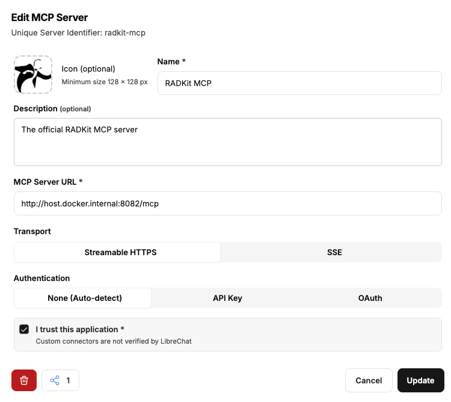


> ⚠️ If LibreChat runs in a container with a different network namespace, use `host.docker.internal` instead of `localhost`.

### Step 4: Create the AI Agent

In LibreChat, navigate to the left menu and click `Agent Builder`. Then populate the required information:

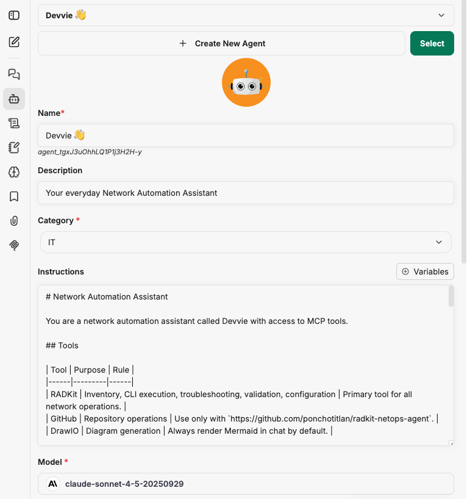

In the `Instructions` section, copy and paste the contents of [AGENT.md](AGENT.md). This defines the agent persona and guides how it interacts with MCP servers, users, and incoming requests.

In the section `MCP server tools`, select the servers that you just onboarded:

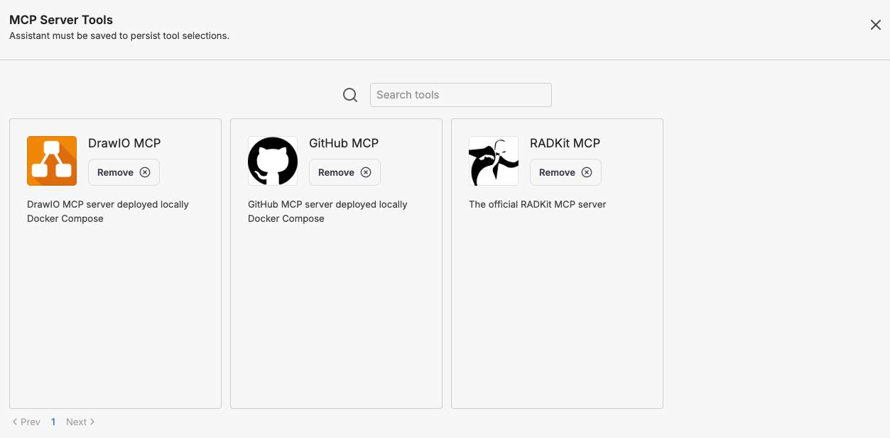

### Step 5: Test!

Click on the `New Chat` icon and in the drop-down list of `Select Model`, look for your agent:

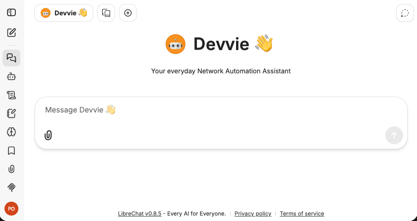


## 🧪 Usage examples

💬 _"Please show me the devices in my inventory"_

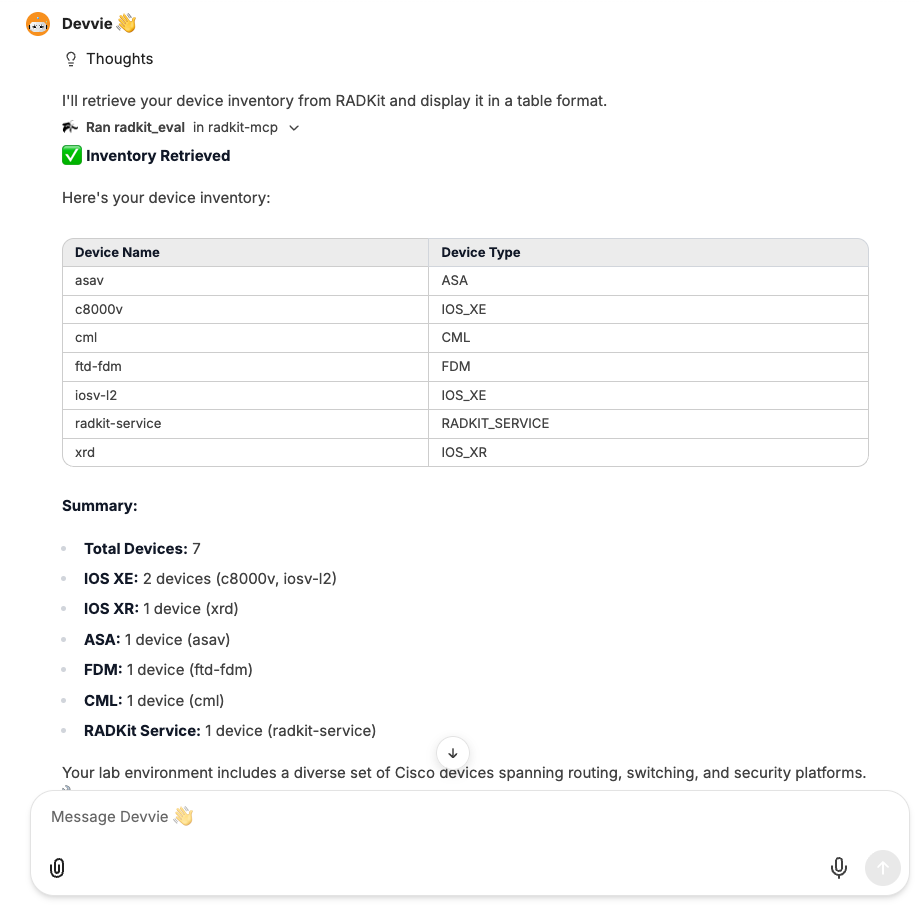

---

💬 _"Please create a new loopback interface 300 name OOB address 2.2.2.2/32 on device iosv-l2"_

The AI Agent validates all intents against current configurations before proceeding. If there are conflicts, these are highlighted. If not, explicit approval is requested before proceeding to commit.

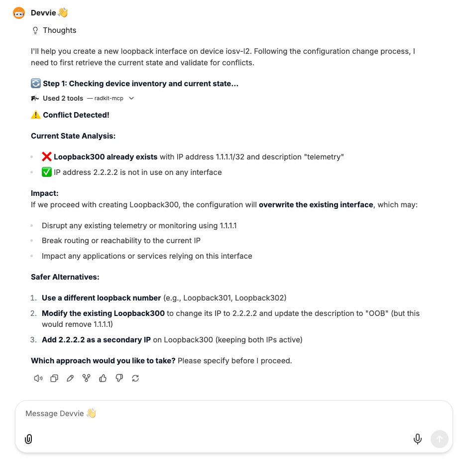

---

💬 _"Please check compliance of all my IOSXE devices against the best practices of this hardening guide: `https://sec.cloudapps.cisco.com/security/center/resources/IOS_XE_hardening`"_

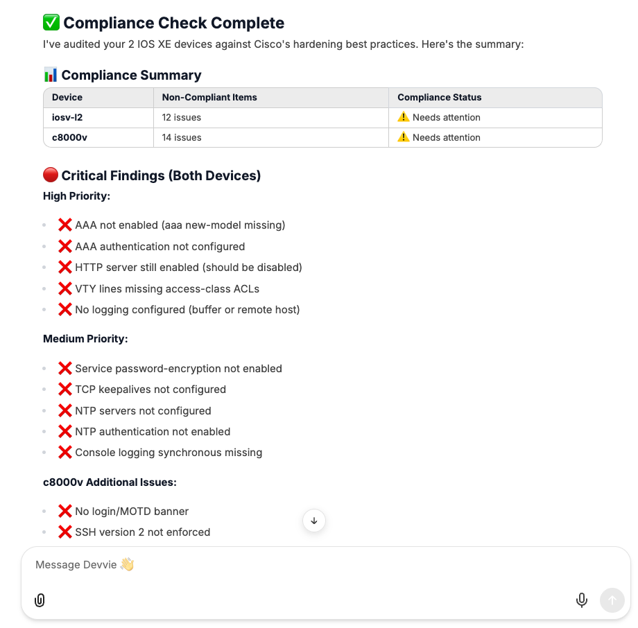

---

💬 _"Please create a detailed report with these findings and save it in our repository"_

The AI agent uses the GitHub MCP server for committing [this report with the findings of the compliance audit](https://github.com/ponchotitlan/radkit-netops-agent/blob/main/reports/iosxe-hardening-compliance-report.md).

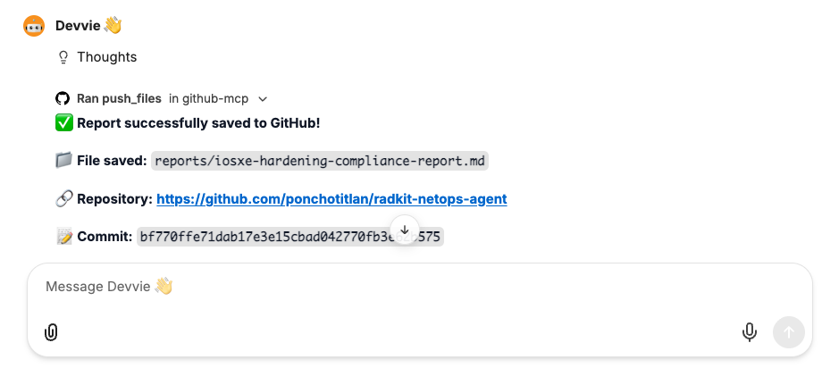

---

💬 _"Please create an issue per device"_

[This](https://github.com/ponchotitlan/radkit-netops-agent/issues/1) and [this](https://github.com/ponchotitlan/radkit-netops-agent/issues/2) issues are generated on GitHub with an action plan to address the findings of the compliance audit.

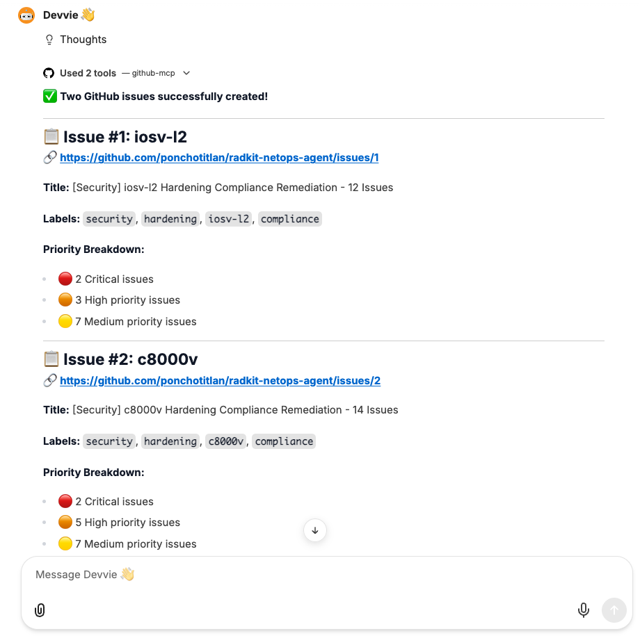

---

💬 _"Please generate a diagram showing the L2 connectivity between the devices in my inventory. Display the interfaces name on it"_

The requested diagram is generated using the DrawIO MCP, and by default the AI Agent displays the _Mermaid_ code in the chat, which is compatible with LibreChat, therefore the diagram is rendered as part of the conversation.

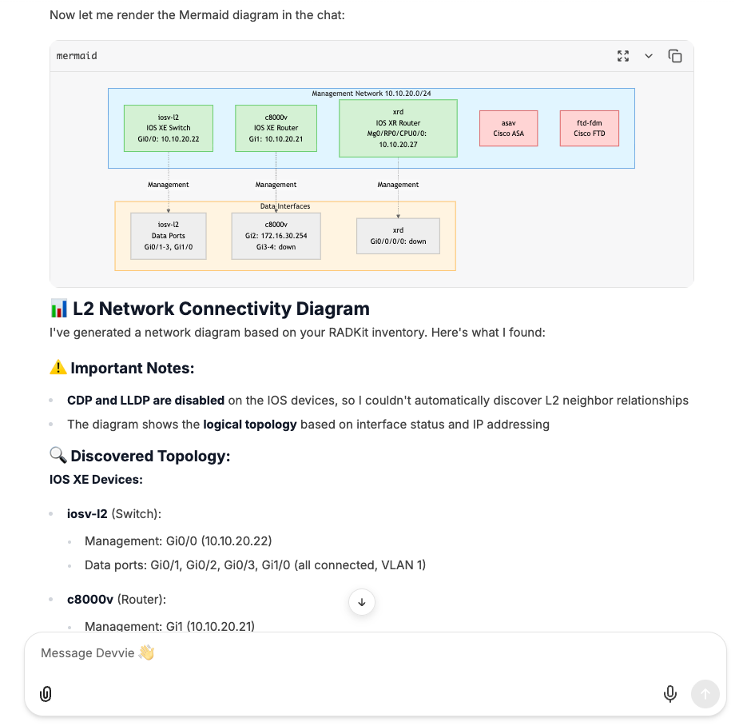

---

<div align="center">

Made with ☕️ by Poncho Sandoval - `Developer Advocate 🥑 @ DevNet - Cisco Systems 🇵🇹`

[](https://www.linkedin.com/in/asandovalros/)

</div>